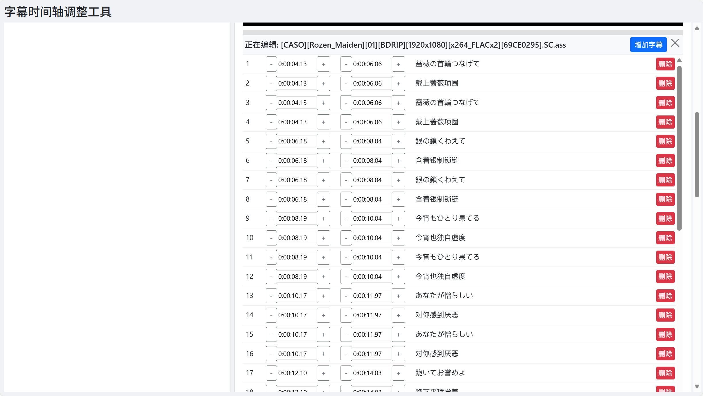

# Subtitle Timeline Adjuster

A simple yet powerful online tool to adjust the timeline of subtitle files (`.srt` and `.ass`) to perfectly match your videos.

## ✨ Features

- **Synchronized Video and Subtitle Preview**: Load a video and a subtitle file simultaneously for a real-time preview of your adjustments.
- **Flexible Timeline Adjustments**:
  - **Batch Adjustment**: Shift the entire subtitle timeline forward or backward. Supports presets (e.g., 50ms) and custom millisecond input.
  - **Individual Fine-Tuning**: In the subtitle editor, you can precisely adjust the start and end times for each line.
- **Powerful Subtitle Editor**:
  - **Add/Delete Subtitles**: Add new subtitle lines at the video's current time or delete any unwanted lines.
  - **Text Editing**: Directly edit the subtitle text within the editor.
  - **Standalone Editing Mode**: Open, edit, and save subtitle files directly without needing to load a video.
- **Player Controls**: Adjust the video playback speed to help you align subtitles in slow motion.
- **File Management**:
  - Supports uploading files from your local machine via file selection or drag-and-drop.
  - (Optional) Supports browsing and loading files from the server.
- **Save and Download**: Once you're done, easily save and download the modified subtitle file.

## 📸 Screenshots




## 🚀 Quick Start (Development Mode)

1.  **Clone the repository**
    ```bash
    git clone https://github.com/ReaderC/subtitle-timeline-adjuster.git
    cd subtitle-adjuster
    ```

2.  **Install dependencies**
    ```bash
    npm install
    ```

3.  **Start the server**
    ```bash
    npm start
    ```
    The server will be running at `http://localhost:3000`.

## 🚢 Deployment (Production Environment)

1.  **Configuration**:
    - Copy `config.example.json` and rename it to `config.json`.
    - **`media_dir`**: (Optional) Set a directory path, e.g., `"C:/Users/YourUser/Videos"`. This enables the "Browse Server" feature, allowing you to access media files from that directory.
    - **`server_token`**: (Optional) Set a password. If set, users will need to enter this token in the "Server Settings" on the front end to access server files or save files.

2.  **Running**:
    It is recommended to use `pm2` or another process manager to keep the application running in the background.
    ```bash
    npm install pm2 -g
    pm2 start src/server.js --name subtitle-adjuster
    ```

## 📝 Usage Workflow

1.  **Add Files**:
    - Click the "Add File" button to select your video and subtitle files from your local machine.
    - Alternatively, drag and drop the files into the file list area.
2.  **Select Files**: In the "Video" and "Subtitle" lists on the left, click to select the files you want to work with (selected files will be highlighted).
3.  **Load and Edit**:
    - **Synchronized Preview Mode**: After selecting a video and a subtitle, click the "Load/Reset Preview" button. The video and subtitles will be loaded into the player, and the subtitle editor will expand below.
    - **Standalone Editing Mode**: Select only a subtitle file, then click the "Edit Subtitle Only" button. The editor will open directly, without a video.
4.  **Adjust and Edit**:
    - **Batch Adjustments**: Use the controls in the "Subtitle Timeline Batch Adjustment" card to shift all subtitles forward or backward.
    - **Fine-grained Editing**: In the subtitle editor, you can:
        - Click the `+` / `-` buttons next to the time fields to make small adjustments.
        - Directly modify the time or text content.
        - Click the "Add Subtitle" button to add a new line.
        - Click the "Delete" button to remove a line.
5.  **Save File**:
    - Click the "Save Subtitle" button.
    - Click the generated download link to get your adjusted subtitle file.

## 🛠️ Tech Stack

- **Frontend**: HTML, CSS, JavaScript (Vanilla)
- **UI Framework**: Bootstrap 5
- **Backend**: Node.js, Express