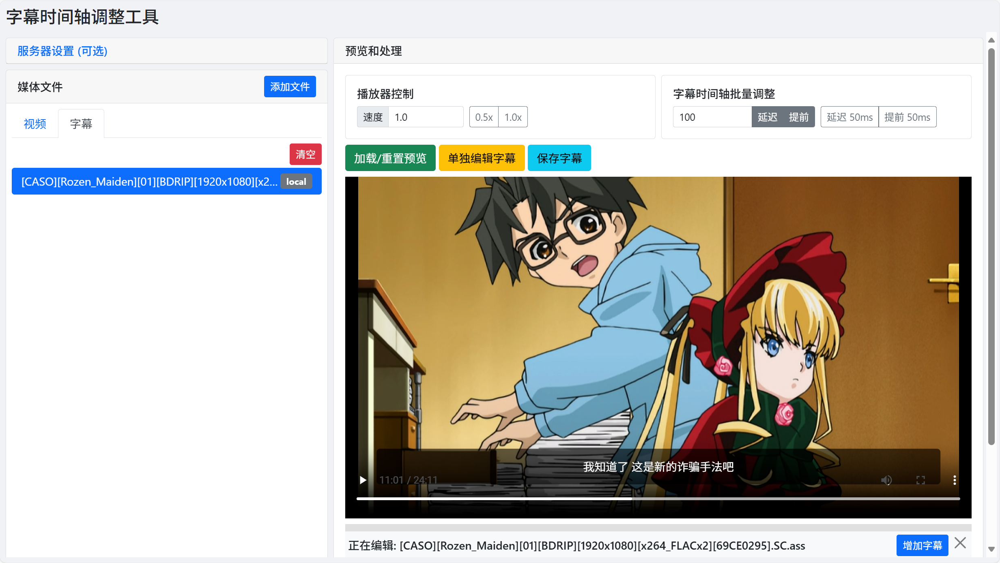

[English Version](./README.en.md)

# 字幕时间轴调整工具

一个轻量级的、支持本地文件和 NAS 文件浏览的 Web 工具，用于调整字幕文件（.srt, .ass）的时间轴，并提供实时预览功能。



---

本工具旨在提供一个简单、快速、轻量化的解决方案，用于调整字幕时间戳，而无需依赖笨重的视频编辑软件。它采用纯 JavaScript 后端，使其可以轻松地跨平台运行，并支持两种文件加载模式。

## ✨ 功能特性

- **双模式文件处理**:
  - **本地模式**: 通过拖拽或文件选择器直接上传你电脑上的文件。
  - **NAS 模式**: 直接浏览和加载在你服务器（NAS）上指定目录中的媒体文件。
- **实时调整**: 在浏览器中即时预览字幕的时间变化。
- **灵活的控制方式**:
  - **快捷微调按钮** 用于精确调整 (+/- 50ms)。
  - **手动输入框** 用于大幅度的时间平移。
  - **可变播放速度** 用于更精确地同步时间轴。
- **Token 鉴权**: NAS 模式下的文件访问可以通过 Token 进行保护，确保安全。
- **跨平台**: 可在 Windows、macOS 和 Linux 上运行 (需要 Node.js 环境)。
- **轻量化**: 无 `ffmpeg` 依赖，所有处理均在 JavaScript 中完成。

## 🛠️ 技术栈

- **后端**: Node.js, Express, Multer
- **前端**: 原生 JavaScript (HTML5, CSS3)
- **字幕解析**: `srt-parser-2`, `ass-parser`, `ass-stringify`

## 🚀 快速上手

### 1. 配置 (重要)

项目支持两种运行模式，通过配置文件进行控制。

- **仅本地模式 (默认)**:
  - 无需任何配置，直接进入下一步安装即可。此模式下无法使用“从 NAS 浏览”功能。

- **启用 NAS 浏览模式**:
  1.  将项目根目录下的 `config.example.json` 文件复制一份，并重命名为 `config.json`。
  2.  用文本编辑器打开 `config.json`，修改其中的内容：
      ```json
      {
        "mediaDirectory": "/path/to/your/media/folder",
        "nasToken": "a-very-secret-token"
      }
      ```
      - `mediaDirectory`: **必需**。填入你 NAS 上存放媒体文件的**绝对路径**。路径分隔符请使用正斜杠 `/` 或者双反斜杠 `\`。
      - `nasToken`: **可选**。设置一个访问口令。如果设置了，前端页面必须输入正确的 Token 才能访问 NAS 文件。

> **高级用法**: 你也可以不使用 `config.json` 文件，而是通过设置 `MEDIA_DIR` 和 `NAS_TOKEN` 这两个环境变量来提供配置。

### 2. 安装与运行

1.  **克隆仓库:**
    ```bash
    git clone https://github.com/your-username/subtitle-timeline-adjuster.git
    cd subtitle-timeline-adjuster
    ```

2.  **安装依赖:**
    ```bash
    npm install
    ```

3.  **运行服务器:**
    ```bash
    node src/server.js
    ```

4.  **打开应用:**
    打开你的网络浏览器并访问 `http://localhost:3000`。

## 📝 使用流程

1.  **(NAS 模式)** 如果你配置了 Token，请先在左上角的“NAS 设置”中输入它。
2.  **添加文件**: 点击“添加视频”或“添加字幕”按钮，在弹出的窗口中选择：
    - **从本地上传**: 弹出文件选择框，选择你电脑上的文件。
    - **从 NAS 浏览**: 浏览你在 `config.json` 中配置的目录，点击选择文件。
    - 你也可以直接将**本地文件**拖拽到对应的“视频列表”或“字幕列表”区域来快速上传。
3.  **选择文件**: 从文件列表中分别点击一个视频和一个字幕来激活它们。列表中的 `(LOCAL)` 和 `(NAS)` 标签会标明文件来源。
4.  **加载预览**: 点击 **"加载/重置预览"** 按钮，将选中的文件加载到播放器中。
5.  **调整与保存**: 使用右侧的控制面板进行实时微调、手动调整或改变播放速度。满意后，点击 **"保存字幕"** 即可下载调整后的文件。

## 📄 开源协议

本项目采用 ISC 许可证。